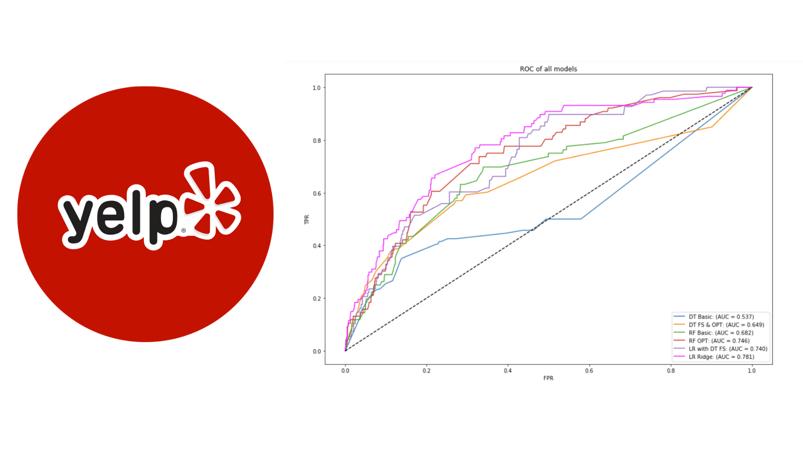

[**Food Happens in Vegas: How can restaurants improve their Yelp profiles for success?**](https://github.com/Emmyphung/Vegas_foodies)

 The purpose of this data mining project is to examine how restaurants can improve their Yelp profile to become more “successful” on Yelp in Las Vegas, Nevada. 
 
Our methodology defines “success” as a binary variable through an exploratory analysis of the restaurants’ review counts and ratings on Yelp. Feature variables include categories and attributes that Yelp users can use to select which restaurant to visit. For this project, we ran Decision Tree, Random Forest, and Logistic Regression to explore key features associated with “success” and obtain recommendations for restaurants to improve their Yelp profile.
 
Models: Decision Tree, Random Forest, and Logistic Regression.

